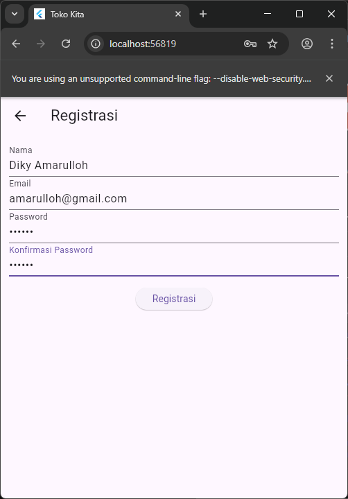
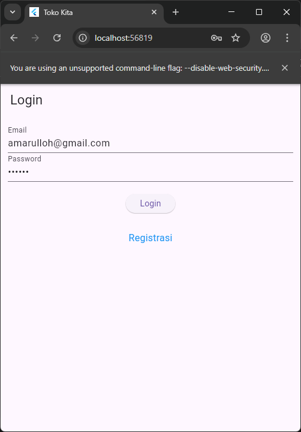
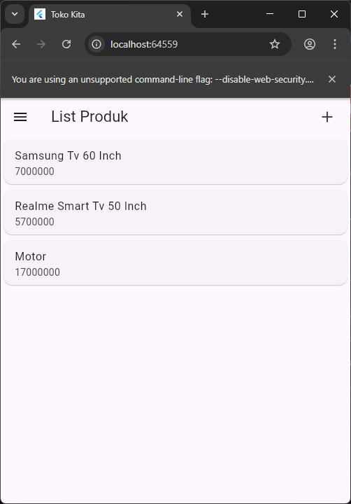
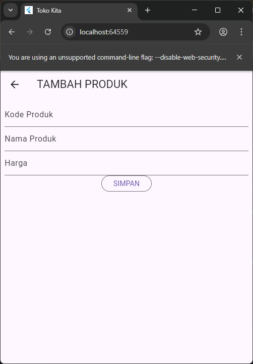

Diky Amarulloh (H1D023081)

Penjelasan tiap halaman

1. halaman registrasi
   pada bagian ini user dapat melakukan pendaftaran ke dalam sistem dengan cara, memasukkan nama, email, password dan konfirmasi passwork

- ini adalah notifikasi yang akan muncul ketika registrasi berhasil dilakukan

2. Halaman login
   - dihalaman user dapat memasukkan email dan password yang sudah terdaftar ke dalam sistem, apabila login berhasil sistem akan mengarahkan ke halaman daftar barang

3. halaman list barang
   - berisi seputar daftar barang yang telah dibut. pada halaman ini user dapat akses tambah barang dan menu pada pojok kiri atas ke tombol logout

4. halaman form tambah barang
-pada halaman ini user dapat menginputkan barang baru dengan cara mengisikan data inputan yaitu kode produk, nama produk dan harga produk. apabila berhasil sistem akan mengarahkan langsung ke halaman list produk

5. halaman detail barang
-halaman ini dapat diakses ketika user mengklik salah satu barang pada halaman list. pada halaman ini user akan mendapat kan informasi seputar barang tersebut, selain itu user juga dapat akses untuk menghapus produk atau mengeditnya

6.notifikasi hpus barang
- notif ini akan muncul ketika user ingin menghapus barang dari halaman detail barang, notif ini adalah konfirmasi untuk meyakinkan user benar-benar ingin menghapus produk tersebut

7. halaman edit
- halaman ini akan muncul ketika user lebih memilih fitur edit dari halaman detail produk. Pada halaman ini user dapat merubah nama, email atau harga barang tersebut, dan ketika data sudah dirubah bisa klik ubah, maka otomatis user akan diarahkan ke halaman list barang

  

