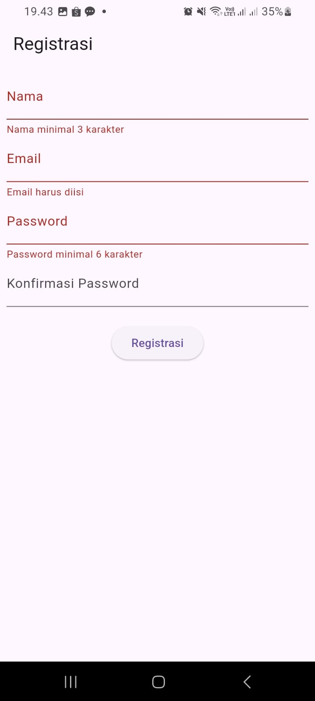
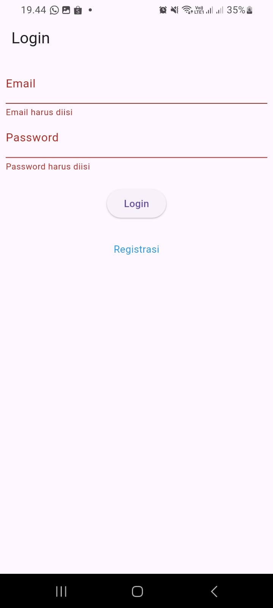
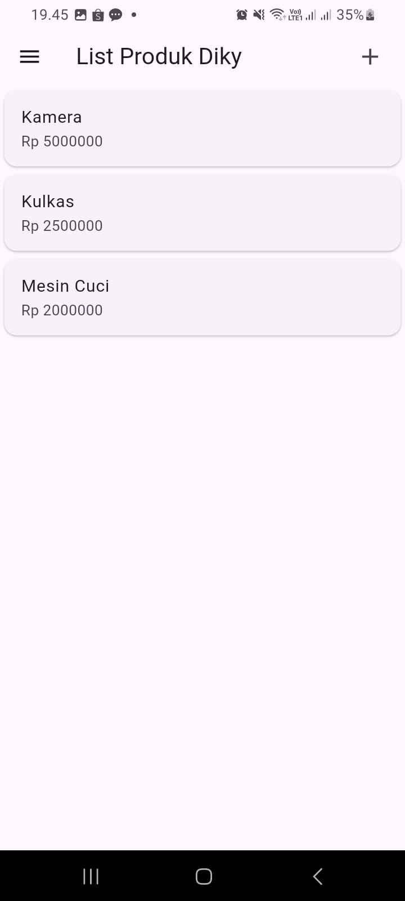
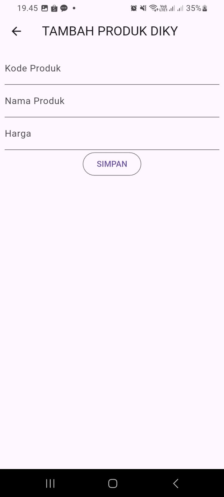
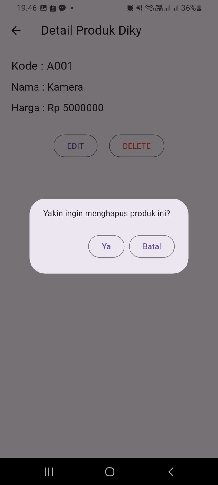

Diky Amarulloh (H1D023081)

Penjelasan tiap halaman
1. registrasi_page.dart
   Kode halaman registrasi berisi form dengan empat TextFormField: nama, email, password, dan konfirmasi password. Setiap field memiliki validator seperti minimal karakter dan kecocokan password. Tombol Registrasi memvalidasi form sebelum data dikirim. Halaman ini menggunakan SingleChildScrollView agar form tetap scrollable saat keyboard muncul. Controller digunakan untuk menangkap input pengguna.

3. login_page.dart
  Kode pada halaman Login terdiri dari form dengan dua TextFormField untuk email dan password. Masing-masing memiliki validator untuk memastikan input tidak kosong dan formatnya benar. Tombol Login memvalidasi form dan menampilkan loading ketika proses login berjalan. Selain itu, tersedia link menggunakan InkWell untuk membuka halaman Registrasi. Struktur halaman menggunakan Scaffold, AppBar, Form, dan Column sehingga UI tersusun rapi.

4. produk_page.dart
  Halaman ini menampilkan daftar produk dalam bentuk ListView. Di AppBar terdapat ikon tambah yang mengarahkan ke ProdukForm untuk menambah produk baru. Drawer berisi menu Logout. Daftar produk sementara masih menggunakan data dummy berupa objek Produk. Setiap item ditampilkan menggunakan widget ItemProduk. Kode berfungsi sebagai halaman utama untuk melihat list produk.   

  

  
5. produk_form.dart
   Halaman form digunakan untuk tambah atau ubah produk. Pada initState(), kode isUpdate() mengecek apakah halaman menerima data produk. Jika ada, field otomatis terisi (mode edit). Ada tiga TextFormField untuk input kode produk, nama produk, dan harga. Field memiliki validator wajib isi. Tombol submit akan memproses simpan atau ubah berdasarkan mode. Form diatur menggunakan GlobalKey agar validasi bisa dijalankan.

   

   
6. produk_detail.dart
Kode halaman detail berfungsi menampilkan informasi lengkap produk seperti kode, nama, dan harga. Dua tombol disediakan: Edit yang membuka ProdukForm dengan membawa data produk, dan Delete yang menampilkan dialog konfirmasi penghapusan. Dialog menggunakan AlertDialog dan menjalankan fungsi delete (nantinya terhubung API). Halaman ini sebagai pusat manajemen data untuk 1 produk. 

